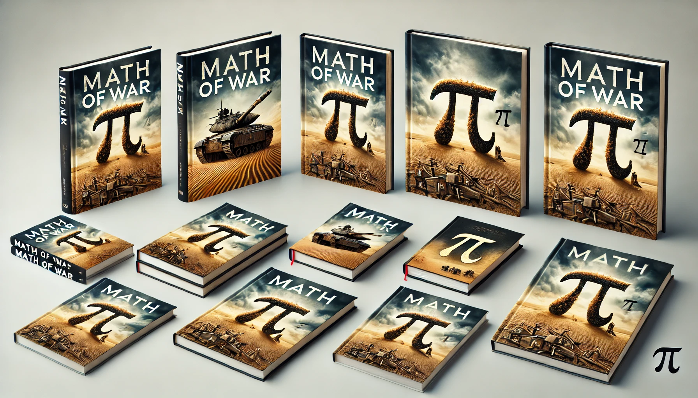

# Math of War

> [!NOTE]
> This repo is used by Vicente Agüero to write the book "Math of War".
> [LinkedIn](https://www.linkedin.com/in/vicente-aguero/)

> [!WARNING]
> This book is a work in progress.
> The first draft is intended to be finished by the end of 2025.
> The book will be published during 2026.

This repo will be used to write the first draft of the book "Math of War".

The book is intended to be a divulgation math book,  that explains the
concepts using historical war examples.

The book will be written in Spanish and English.

The spanish version will be written first because I want to have a first draft
of some initial chapters before starting the translation to English.

Then, I will write the first complete draft in English.

Probably, this book will be published first in Amazon. But, I will try to have
a draft to contact some publishers to see if they are interested in the book.

This book will be written using Markdown, because then the format can be easily
converted to other formats using some Python scripts.

Each chapter will be a Markdown file.

## Table of Contents

Work in progress.

## Book Design Concept

For more information about the design concept of the book, please check the
[Design Concept](design_concept.md) file.

---

## To Do

- [ ] Write the Table of Contents.
- [ ] Choose some historical wars to use as examples.
- [ ] Choose the mathemathical concepts to explain in each chapter.
- [ ] Write the first draft of one chapter.